# PUSH-SWAP
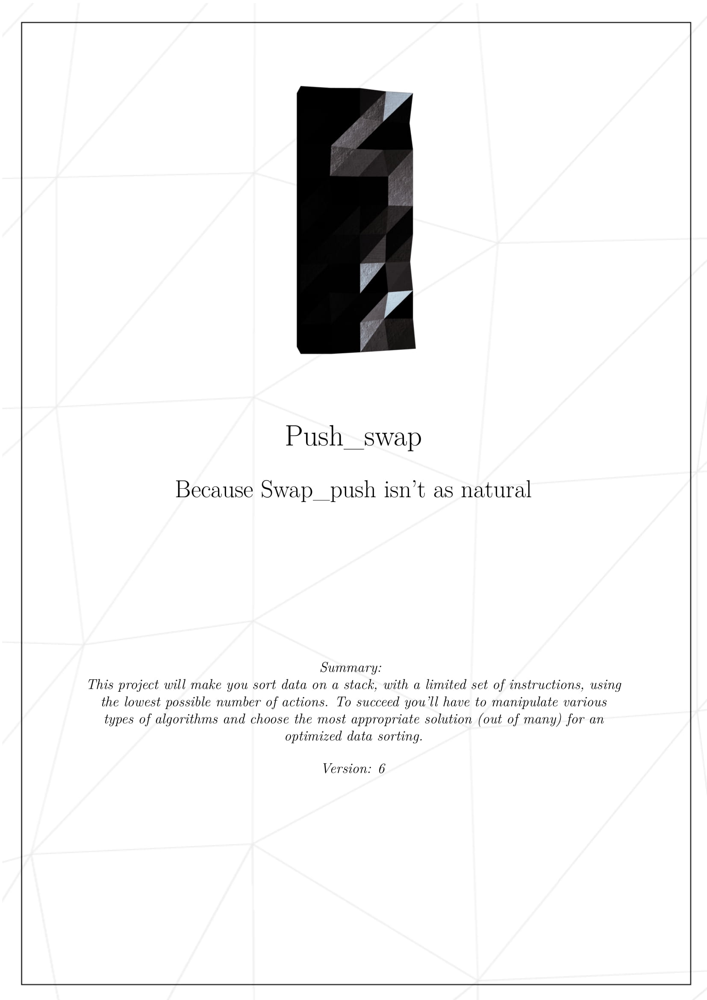
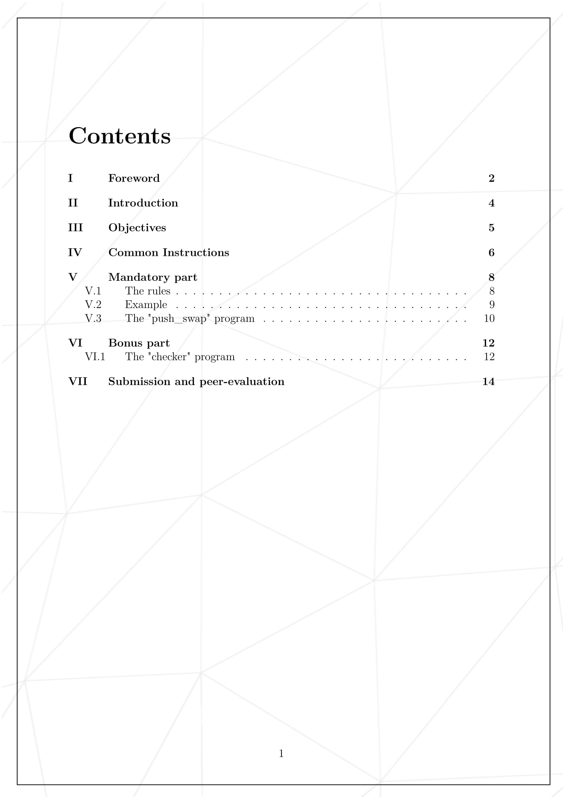

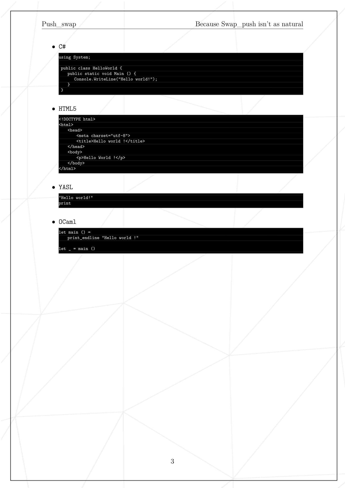
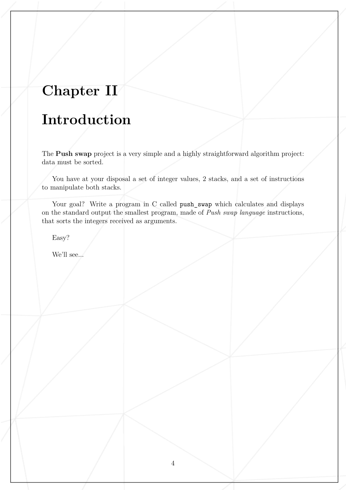
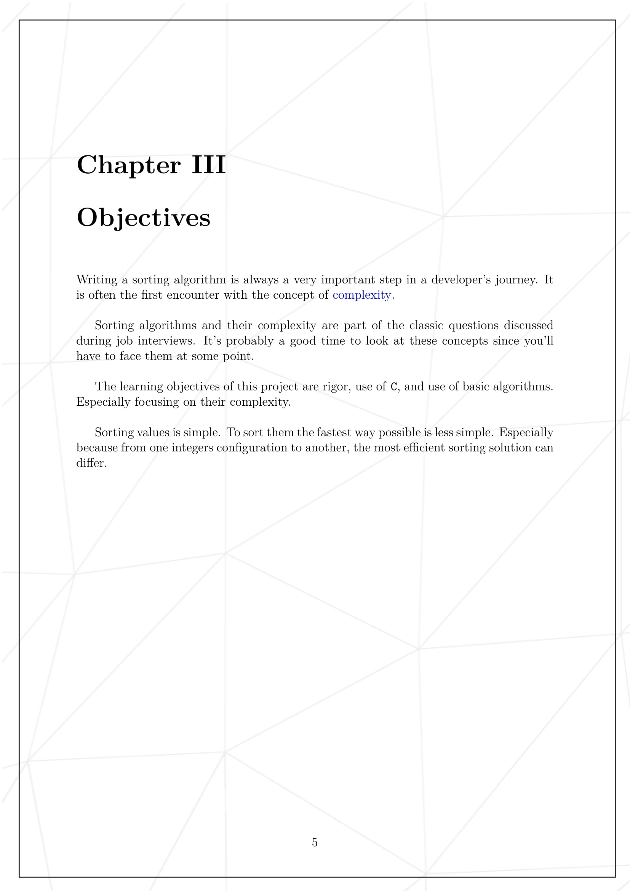
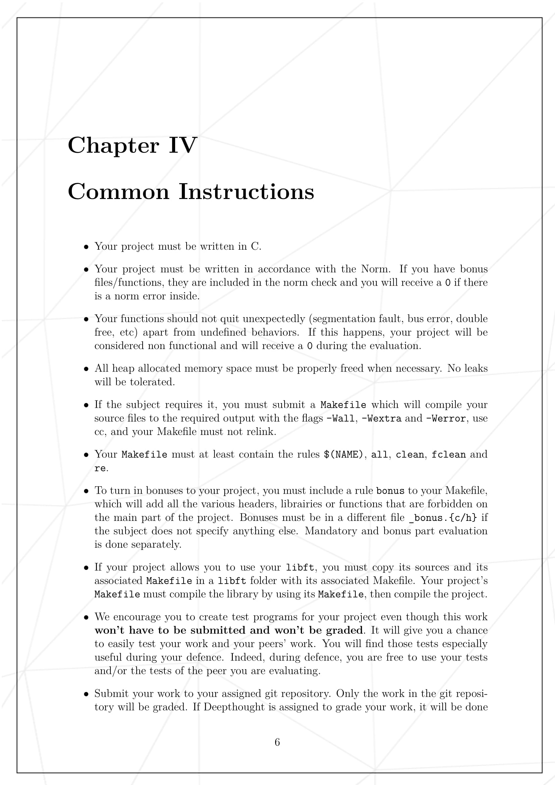
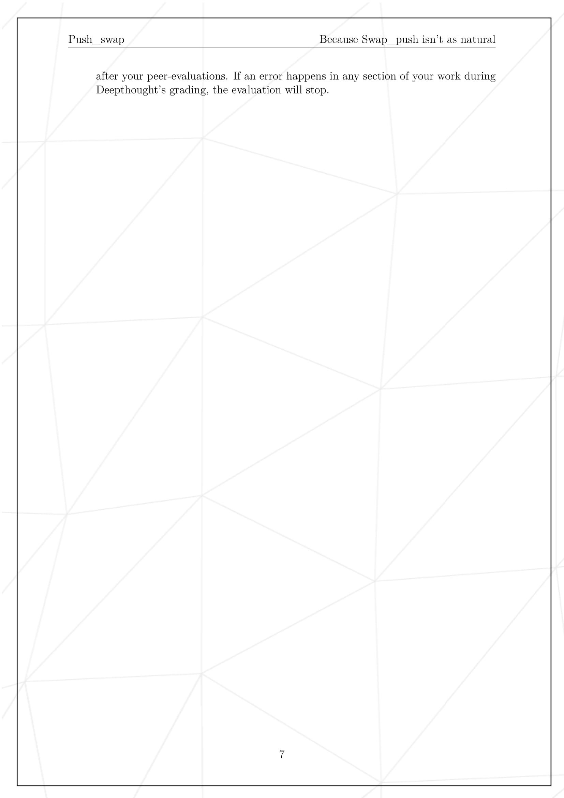
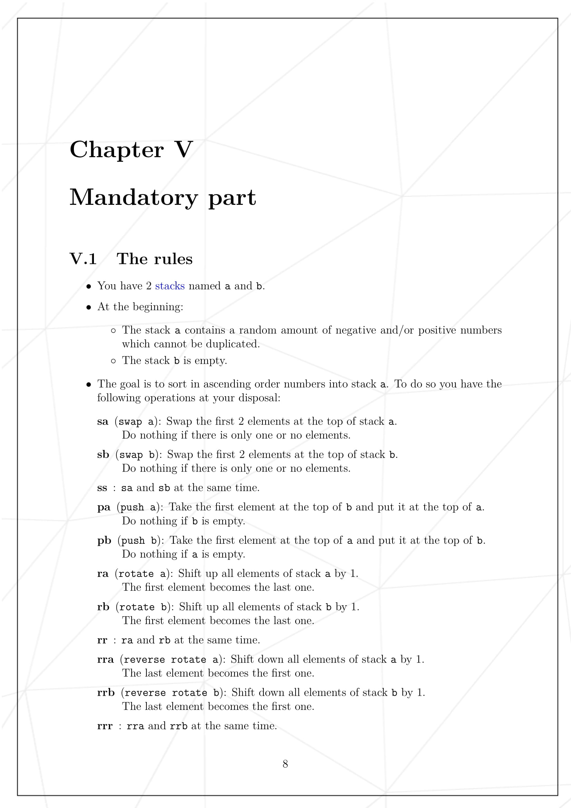
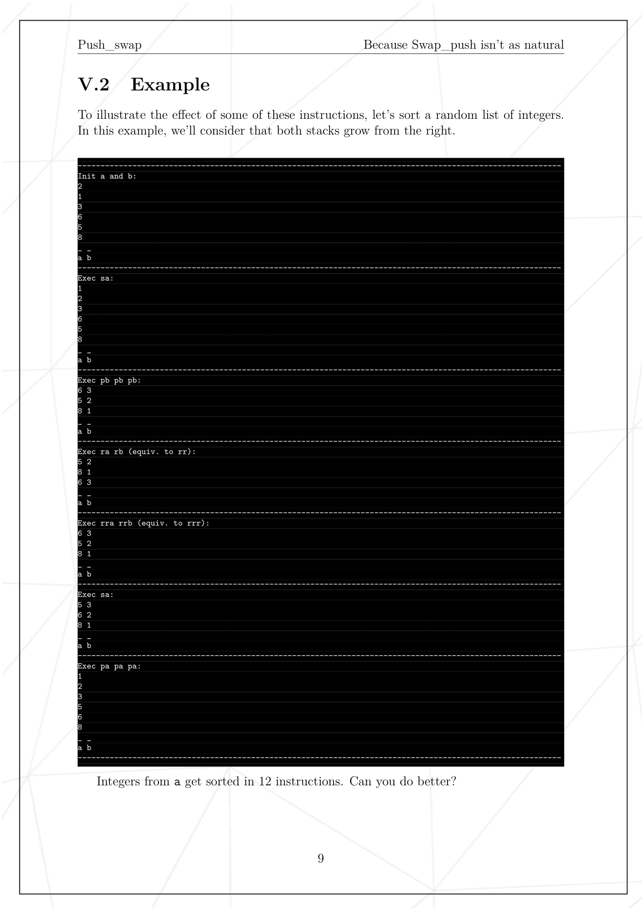
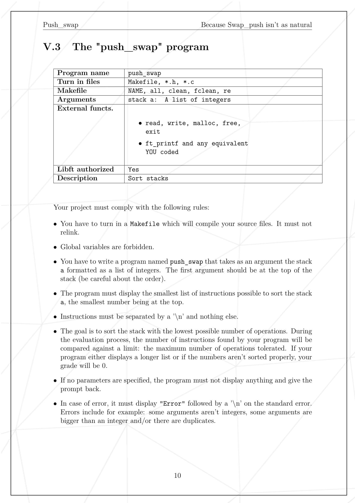
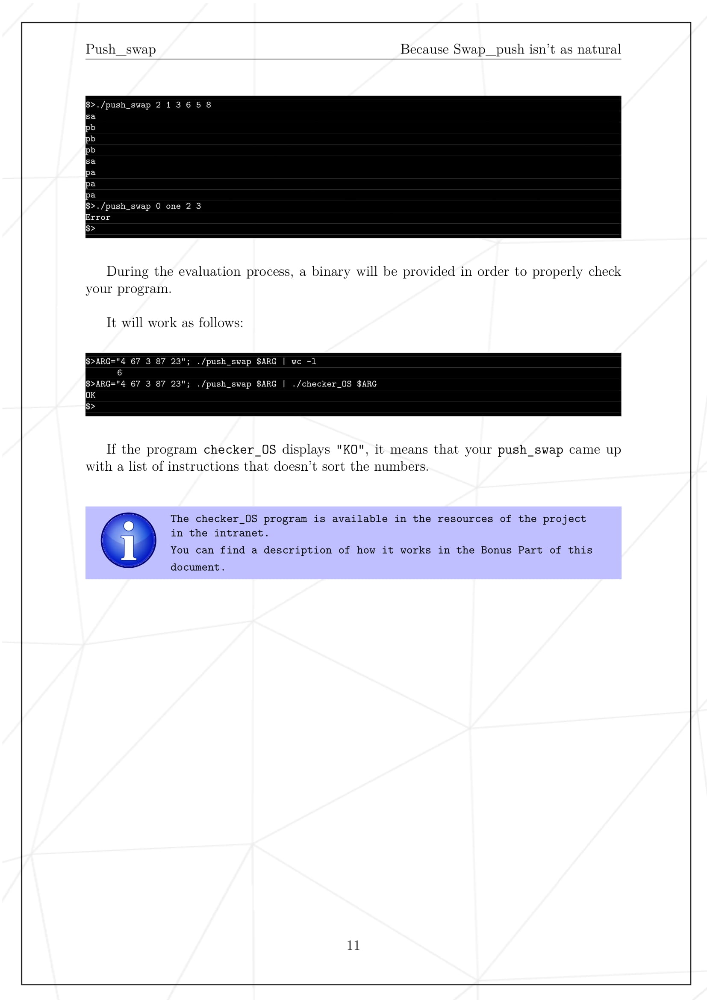
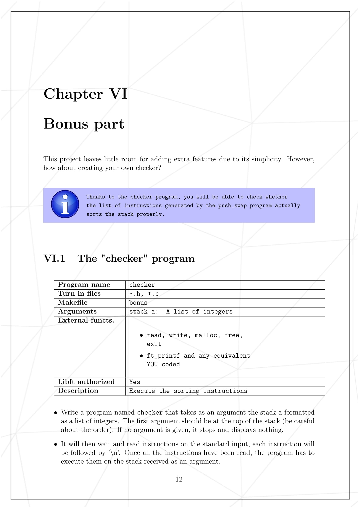
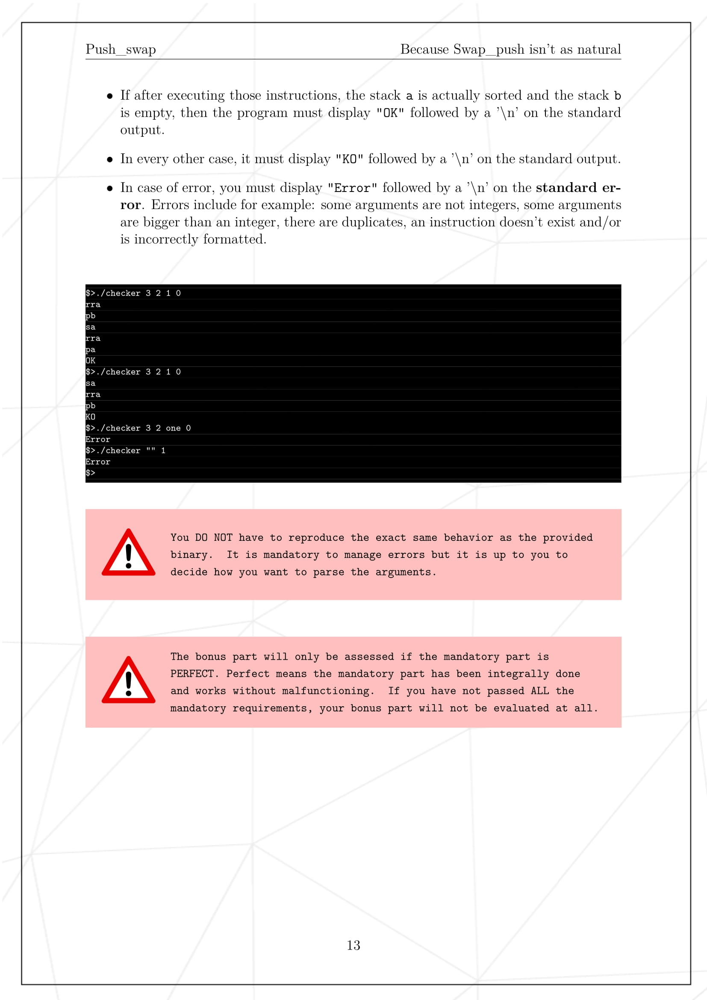
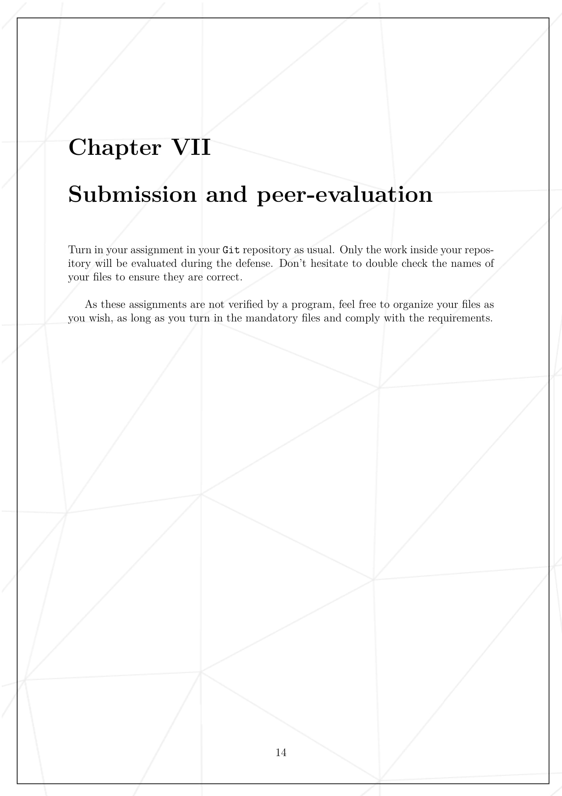
<h1>Push Swap</h1>

Push Swap is a sorting algorithm that aims to sort a stack a using strict moves and another empty stack called b.

<h2>The rules</h2>

To use the Push Swap algorithm, you will need to have a stack a containing a random amount of negative and/or positive numbers that cannot be duplicated, and an empty stack b.

The goal is to sort in ascending order numbers into stack a. To do so you have the following operations at your disposal:

<ul>
  <li>sa (swap a): Swap the first 2 elements at the top of stack a. Do nothing if there is only one or no elements.</li>
  <li>sb (swap b): Swap the first 2 elements at the top of stack b. Do nothing if there is only one or no elements.</li>
  <li>ss : sa and sb at the same time.</li>
  <li>pa (push a): Take the first element at the top of b and put it at the top of a. Do nothing if b is empty.</li>
  <li>pb (push b): Take the first element at the top of a and put it at the top of b. Do nothing if a is empty.</li>
  <li>ra (rotate a): Shift up all elements
  <h2>Getting started</h2>

1.  **Initial Analysis**: The algorithm starts by performing an initial analysis of the stack a to determine the positions of the elements within it.
2.  Indexing: The algorithm uses indexing to keep track of the positions of the elements within the stack a. The index of an element is determined by the number of elements that are lower in value than it.
3.  **Range**: After the initial analysis and indexing, the algorithm uses a range between i and j to make decisions about which operations to perform. The range is initialized with i = 0 and j = 15 if the length of the stack is lower than 100, otherwise j = 42.
4.  **Operation Selection**: The algorithm compares the index of the first element in stack a with the range to determine the most efficient operation to perform. If the index is less than i, the element is pushed to b (pb). If the index is less than i + j, the element is pushed to b and b is rotated (pb, rb). If the index is greater than or equal to i + j, stack a is rotated (ra).
5.  **Sorting Stack b**: After all elements are in stack b, the algorithm uses the position of the maximum element in stack b to determine the most efficient operations for sorting the elements in stack b and moving them back to stack a. If the position of the maximum is less than the middle of the stack, b is rotated (rb) until it gets to the top. If the position of the maximum is greater than the middle of the stack, b is reverse rotated (rrb) until it gets to the top. The element is then pushed to stack a (pa).
6.  **Repeat**: The process is repeated until stack b is empty, resulting in a sorted stack a.

## Performance

The goal of the algorithm is to sort 100 elements with less than 700 moves and 500 numbers with less than 5500 moves. The algorithm uses optimization techniques such as initialization of i and j values based on testing, to achieve this goal.

# Push Swap Checker

The Push Swap Checker is a tool that can be used to verify the correct implementation of the Push Swap sorting algorithm.

## How it works

To use the Push Swap Checker, you will need to have a list of non-duplicated numbers and a list of operations to execute.

The checker will apply the operations to the list of numbers and check if the resulting stack is sorted. If the stack is sorted, the checker will output "OK", otherwise it will output "KO".

## Contributions

If you would like to contribute to the Push Swap project, please feel free to submit a pull request with your proposed changes.

## Contact

If you have any questions or feedback about the Push Swap project, please feel free to contact me at zmakhkha@student.1337.ma.
